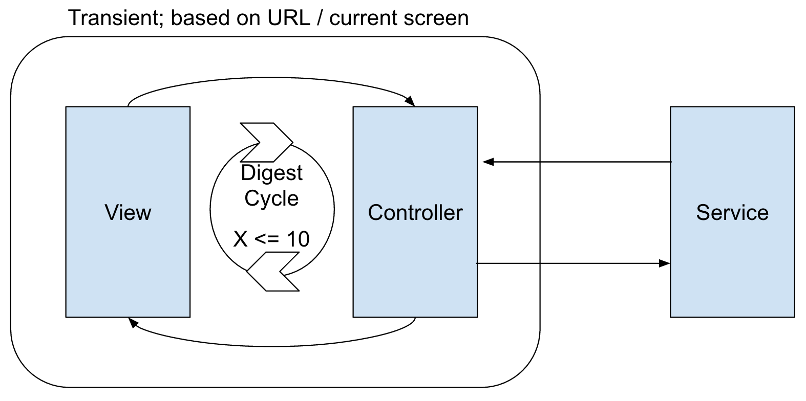
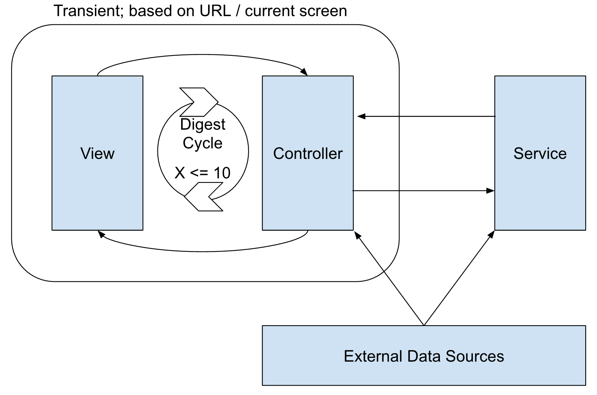
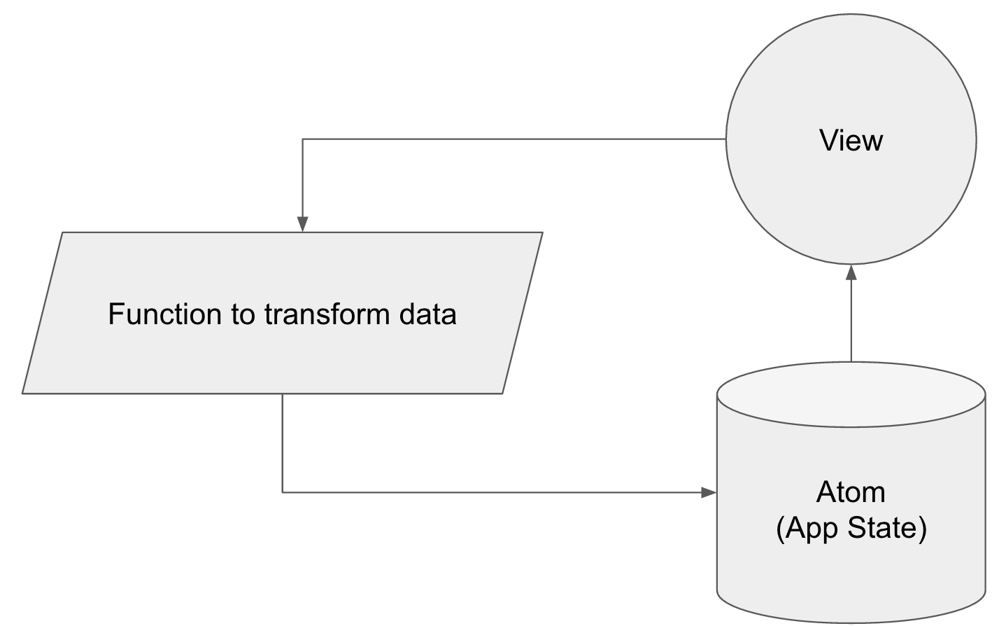

# Objectives
+ Improve Development Workflow
+ Tighter feedback loops
+ Improve User Experience
+ Improve Code Quality

# Table of Contents
1. Introduction
2. The Digest Cycle; State vs. Immutability
  - AngularJS
  - State vs Identity
  - State in Clojure
  - Clojurescript
  - Clojurescript for UIs
  - ClojureScript Advantages over Javascript
3. The ClojureScript Ecosystem
  - Leinengen (yeoman/npm++)
  - Google Closure Compiler (webpack++)
  - Figwheel (live development/auto reload/human debugging)
  - Tools Summary (Javascript Interop)
5. Rapid Feedback Loops via Component-first development (Devcards)
  - Forces us to think about data in the beginning
  - Extremely easy edge-case testing
  - Rapid iteration and the ability to "Drop Into" the application
4. Unit testing UI components
  - Devcards may be sufficient
  - Components as functions
  - Randomly generated test data
  - Spec?
5. The Community
  - Clojure for front and back
  - JS interop for libraries like Leaflet
  - Community (& Hammock-Driven Development)

# Introduction: The OpenWhere User Interface State of the Union
Developing the user interface is the bottleneck for many of our products.

Developing UIs involves shifting both bits *and* pixels, which is a
time-intensive process. Because it takes longer to develop UIs (generally
speaking) than the backend components that support them, our capability backlog
of backend-supported features piles up, putting pressure on UI developers to
expedite the UI development process.

This time pressure, coupled with the fact that we have no customers embedded on
the product team, means that insufficient time is given to usability and user
experience.  We're inclined to say "good enough" to the features we develop,
because they'll be presented to users at some point in the future, and we'll
improve upon those features even further down the road.

Without active engagement and tight feedback loops, we assume that the features we
implement are not in their final form, so writing automated tests for them takes a
back seat. Unit testing UIs is hard; why should we spend time testing unfinished
features when there are NEW features that need implementing?

This leads to codebase entropy (technical debt), because every "just-get-it-done"
feature is an untested feature that may change when we put it in front of users.
We cannot design a consistent application when every feature is developed in a
vacuum without user input. Every usability change we're rushed into making
(because we didn't budget time in the sprint for user feedback) results in a
tangle of code, because the desired behavior was not considered as part of the
initial design.

We're not bad or sloppy developers; we clean up the code even as we implement
new features. The new features we write now will be ones we clean up in the
future; this isn't a bad thing, it's continuous refactoring. Unfortunately, most
continuous refactoring fixes are "quick wins," because anything that could bring
about the BIG wins (such as when we implemented webpack or UI routing) takes
weeks to implement and doesn't result in any new features or cosmetic enhancements,
making it a hard sell to the people writing the checks. Those big wins allowed
us to successfully deliver R9 on an extremely aggressive schedule, but we only
celebrate what we can see, and what we can see still needs improvement.

As our codebase grows, our technical debt compounds, but our productivity
"income" remains constant. We quickly find ourselves in a negative feedback loop
where any forward velocity on new features results in twice as much technical
debt per hour of labor. How do you convince stakeholders that it's necessary to
spend weeks fixing invisible problems when there are very visible problems that
need fixing along with requested features that haven't yet been developed?

As we become a customer-facing organization, the quality of our user interfaces
becomes extremely important. I believe "good enough" is no longer good enough,
and that changes (both cultural and technical) need to be made to how we develop
user interfaces in order to achieve our full potential.

# Clojure(script) is the answer
I have invested months of my free time researching technologies and techniques
in search of answers to the problems outlined above. I've discovered that there
are battle-tested tools and practices (used by other companies whose products and
services we like and respect, such as CircleCI) that could fundamentally improve
the way we build UIs at OpenWhere: Both the process (for developers AND
stakeholders) as well as the end product.

Every solution I've sought for these problems has eventually led back to the
Clojure community. They have treasures are hiding in plain sight for anybody who
can get past the parentheses, and I'm excited by the practices and techniques
enabled by these tools.

What I am proposing will not be simple to implement. Learning new tools, problem-
solving techniques, and ways of thinking about problems is a time-intensive
process, and I understand that time is a resource that is in short supply.

What I hope to convince you of, however, is that the dividend offered by these
new tools and skills will far outweigh the cost of learning them.

In fact, I believe the benefits are so great, they outweigh even the cost
of transitioning our existing products to Clojure(script).

My objective today is *not* to sell you on a rewrite of our codebase.

My objective today is to discuss, in detail, how the Clojure/Clojurescript
ecosystem can vastly improve the quality of life for UI developers and
stakeholders, how it can speed up our UI development process, how it can lead to
tighter, **positive** feedback loops, and how it enables easy (and thorough) unit
testing of the UI.

Hopefully, what you'll take away from this is a willingness to have the hard
conversation about the cost of adopting new tools and practices. Because there
are some real treasures here; I only hope I can do a sufficient job explaining
the benefits.

# The Digest Cycle; State vs. Immutability

## AngularJS
Ask any developer who has touched the UI on our team: state management in Angular
is a pain. When I say state, I'm talking about the sum total of all variables in
the system; everything that's on the screen, and everything that could be lurking
on the next screen. Search results, which buttons are toggled on, the color
of the datasets; if it's interactive or navigable in some way, state is involved.

A view comprises a certain set of items on the screen. Every view has an
associated controller, which holds the variables (state) associated with that
view.  When a user changes something on the screen, the Digest Cycle runs, and
that value gets updated in the controller.  Likewise, if some logic in the
controller runs that causes a value to be updated, the digest cycle will update
the view automatically. Two-way data binding.

Sometimes, updating one variable can cause changes to cascade to multiple
variables, and many things will need to be updated at once. That's no problem:
the digest cycle will run up to 10 times for any given event, but any more than
that and the system will throw an error (to prevent infinite recursion).

In addition to the system updating its state incrementally, we have the problem
of state being transient. If the user navigates to a different view, the
controller associated with the previous view is destroyed, and all the state
built up in that controller is lost.

State that needs to persist between Views gets saved to a Service, where the
controller can pull out the cached data if we navigate back to a previous view.
Services are persistent as long as the application is running, but are themselves
reset every time the browser is refreshed.

If we want to persist data beyond a browser session, we will need to employ
external services (such as a database) for storing our information long-term.
How to coordinate external services with Services/Controllers/Views is its own
can of worms.

## State vs. Identity
Before we contrast Angular with Clojurescript's state management, we need to talk
about how Clojure views state.

Clojure makes a strong distinction between **state** and **identity**, and strongly
favors the concept of immutability. State should be immutable; identity should
be what changes.

For example, let's look at Scott Herman's employment history. Currently, he works
at BlackSky. Prior to this, he was at OpenWhere, DigitalGlobe, GeoEye, VisualCV;
on and on back through time.

No matter now many jobs Scott Herman takes in the future, his employment history
will not change. That is the immutable state of "Scott's employer." The
*identity* of his employer will change with each new job he takes, but he cannot
mutate his employment history.

You can think of Git as another tool that employs identity and immutable state.
Each commit adds to the state of the codebase, and the *identity* of the codebase
is the sum of all check-ins. Git does not enforce immutability, as anybody who has
force-pushed a commit can tell you, but it's generally considered bad form to
change history.

## State in Clojure
There are some [great writeups](http://hypirion.com/musings/understanding-persistent-vector-pt-1)
(complete with diagrams!) that do a excellent job explaining the implementation
of Clojure data structures, so I won't go into too much detail here. The
important thing to note is that data structures in Clojure are immutable,
and this enables them to be extremely performant. According to the site linked
above, Clojure's data structures:

> [give] practically O(1) runtime for appends, updates, lookups and subvec. As
they are persistent [(immutable)], every modification creates a new vector
instead of changing the old one.

I strongly encourage you to read the article; there's some really neat computer
science happening in there. The Clojure community leverages these highly
performant and immutable data structures to achieve some big usability wins, as
we'll see shortly.

## Clojurescript
Clojure is a language that compiles to JVM bytecode. Clojurescript is that same
language when compiled to Javascript. For all practical purposes, the languages
are functionally and syntactically equivalent, but code written in Clojurescript
can run in the browser. From the [rationale section](https://github.com/clojure/clojurescript/wiki/Rationale)
on the Clojurescript Github wiki:

> ClojureScript seeks to address the weak link in the client/embedded application development story by replacing JavaScript with Clojure, a robust, concise and powerful programming language. In its implementation, ClojureScript adopts the strategy of the Google Closure library and compiler, and is able to effectively leverage both tools, gaining a large, production-quality library and whole-program optimization. ClojureScript brings the rich data structure set, functional programming, macros, reader, destructuring, polymorphism constructs, state discipline and many other features of Clojure to every place JavaScript reaches.

Pay special attention to the part about the Google Closure library. This is a
HUGE "free win" for UI development. We'll talk more about this later.

## Clojurescript for UIs
Applications written in Clojurescript rely on Facebook's fantastic [React library](https://facebook.github.io/react/blog/2013/06/05/why-react.html)
for their view layer. This is important because of how React handles rendering:
The view is a reflection of the data associated with components. There is no
two-way data binding. Instead, the view treats application data stores as the
single source of truth.

React is only a view layer, however. The Javascript ecosystem is fragmented when
it comes to how to handle the datastores and plumbing that powers the React-based
views. The libraries for the non-view parts of React web apps number in the dozens:
Flux, Redux, Alt, Flummox, MartyJS, McFly, DeLorean, Lux, OmniscientJS, on and on.

Good thing we're using Clojurescript! This is where Clojurescript's immutable
data structures begin to shine: We define the state of our entire application in
a single data structure (Clojure's [Atom](http://clojure.org/reference/atoms)),
and the UI reflects this data structure.

But wait, if data structures are immutable, and our UI is backed by a single
object, how do we update our UI?

Great question!  Remember our discussion about State vs. Identity? The UI is a
reflection of the current *identity* of the Atom. Atoms can have **transactions**
applied to them, in which Clojure takes care of ensuring that these transactions
are atomic, and the complete history of the Atom is saved thanks to the magic of
Clojure's persistent (immutable) data structures.

Like Git, the Atom represents the state of our application, and we can transact
(commit) some data to it. Clojure makes sure the transaction is atomic (no merge
conflicts), and the identity of our state now points at the new values, while
preserving the "commit history" of all older states.

The result is that application data flows in a circle.

Even if we introduce some complexity with the addition of external data sources,
transactions on Clojure atoms are atomic (how about that!), so there's no chance
that our state will get out of whack. Contrast this with Angular, in which the
user is responsible for maintaining all variables individually in the midst of
transient controllers.

In Clojurescript, all we need to do is update our global application state (our
Atom), and the UI will reflect the data stored therein. No digest cycles to
update co-dependent values (and subsequently, the UI) incrementally, just a
lightning-fast diff using React's VirtualDOM and Clojure's persistent data
structures.

## ClojureScript Advantages over Javascript
Backing the state of our application with an Atom has numerous advantages
compared with vanilla Javascript options:

+ The concept of "undo" is extremely easy to implement; because we have the
  complete state history in our atom, and all transactions are saved (think: git
  commits), restoring the atom (and, thus, the UI) to a previous state is
  trivial.
+ The (nearly O(1)) efficiency of operating on Atoms, coupled with React's
ability to quickly calculate DOM reflows thanks to its [Virtual DOM](http://reactkungfu.com/2015/10/the-difference-between-virtual-dom-and-dom/),
  means that UI updates are extremely quick and jank-free.
+ Clojure's functional nature and immutable data structures, unlike Angular's
  two-way data binding, makes it difficult to introduce side-effects, which,
  in turn, reduces (or eliminates) a whole class of bugs generally present in UI
  development.

# The Clojure(Script) Ecosystem
Better the demon you know that the one you don't, right?
Surely, working in Clojure is just as awful as all the rumors you've heard.
All the *parentheses!*

You may be pleased to know that the Clojure(Script) ecosystem is a much easier
ecosystem to navigate than the Javascript ecosystem. Granted, the Javascript
ecosystem is the butt of most development jokes these days, but the Clojure
ecosystem isn't just a little bit better, it's pretty darn good.

This section describes the tools that comprise the Clojure(script) ecosystem,
and exists to show you that the grass is, in fact, greener on the other side.

## Leiningen
Leiningen is Clojure's answer to project management. It handles the jobs of many
different Javascript tools:

+ Dependency management (like NPM and Bower)
+ Project scaffolding (like Yeoman, and others)
+ Task running (like Grunt or Gulp)

It's just one tool. And it's not crap. It's great!

## Google Closure Compiler
Remember I said we'd talk about this guy again? The Google Closure Compiler is
fantastic, because it compiles all our Javascript into a single file.  Think
webpack on steroids, because the Google Closure Compiler also does dead code
elimination. I won't go into [the details](https://medium.com/@roman01la/dead-code-elimination-and-tree-shaking-in-javascript-build-systems-fb8512c86edf#.f2w2rszib)
here, but suffice it to say that **our compiled UI code will shrink from
megabytes to dozens of kilobytes**. An order of magnitude or more. Really!

Why don't we just use the Google Closure Compiler with our Javascript?
Great question!

The reason we don't use the GCC with our Javascript is because Javascript must be
written to the compilers specifications. This would require us to rewrite all
our Javascript, and many of these specifications have [special
requirements](https://about.zoosk.com/en/engineering-blog/integrating-angularjs-with-a-large-google-closure-codebase/)
for working with AngularJS projects.

Luckily, all the code generated by the ClojureScript compiler is GCC-compliant,
and we end up with lots of functionality in a very small code footprint *for
free*.  I really can't emphasize the power of dead code elimination enough. Even
core features of the Clojure(Script) language are eliminated if you don't employ
them in your codebase.

## Figwheel
Figwheel is responsible for a HUGE improvement in developer productivity and
quality of life. It's a tool that, when you actually use it, feels magical. No
hyperbole.

The author, Bruce Hauman, has stated in numerous
[videos](https://www.youtube.com/watch?v=j-kj2qwJa_E) and
[podcasts](http://blog.cognitect.com/cognicast/102) how he wanted to solve a
problem that most developers accepted as part of working in web programming:
refreshing and losing state. Watch the video linked above, because Bruce does a
better job explaining than I can in a paragraph of text.

The TL:DW; version of it goes like this: Figwheel watches your codebase, and
every time something changes, it *instantly* updates the browser **without
refreshing**. This is accomplished thanks to Clojure's functional nature and its
persistent data structures being a reflection of the UI. You'll never need to
click click type click click to revert back to an edge case ever again -- you
can set the conditions for an edge case directly in your atom, and then test
changes to the UI without ever refreshing and losing state.

This feature will save HOURS of developer time every release, and makes for an
incredibly positive development experience. Developers don't lose flow state,
feedback is instantaneous, and as a result, more work gets accomplished in less
time.

## Tools Summary
The other tools we will be working with are more implementation details than
they are directly responsible for the improvements we're discussing here, so
they are not immediately relevant to this discussion. There is one last thing I
do want to mention about the ClojureScript ecosystem:

**ClojureScript has Javascript interoperability**. That means that any
third-party Javascript library (such as Leaflet) works in Clojurescript, and
your Clojurescript functions can invoke the Javascript functions as part of the
library.
