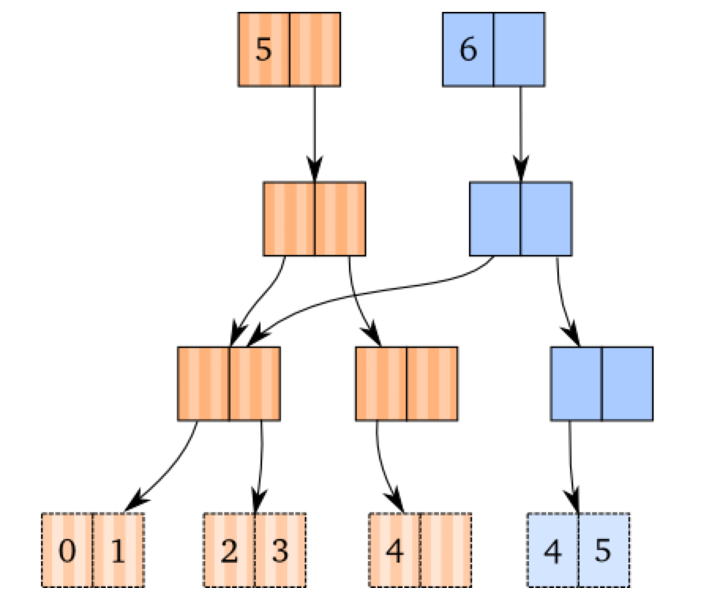

# Building Performant Web UIs
Or: The best parts of Clojure ported to Javascript
Or: Why can't we just be a Clojure shop?

# What is Performance?
+ 60 FPS
+ 1000ms / 60 Frames = 16ms / frame
+ The goal is to achieve a page update speed of < 16ms
+ Any slower than this, the app feels "janky" (it stutters or freezes intermittently)
+ Users begin to perceive lag at 100ms
+ Web requests + DOM update should be < 100ms
+ All changes to the DOM should be lte 16ms

# Updating the DOM in Angular
+ Two-way data binding...
+ ...via the Digest Cycle...
+ ...which checks every variable over and over for changes
  - Every `{{expression}}` in views
  - Every `$scope.watch[Collection]()` function

When the digest cycle is triggered, Angular will iterate over every variable it
is watching and perform an object comparison to see if the watched object has changed. If so,
Angular will rebuild the DOM and kick off a second digest cycle to catch any
side effects of the change. This continues until there are no more changes, at
which point Angular stops running digest cycles until another event occurs (such
as user interaction with the view, callback returning and changing a $scope
variable, etc.), at which point we start the process over again.

Let's look at quantifying the expense of the digest cycle:

# Quantifying the Cost of the Digest Cycle:

## Watchers in AlertWhere-UI
+ Map Explorer: 422 (562 with color modal open)
+ Collection Candidates: 498 (582 with filter modal open)
+ Bookmarks: 619 (No bookmarks selected)
+ Content Explorer
  - 814 (News Articles, Today)
  - 567 (Twitter, Arabic Conflict)
  - 993 (Saved Search)
+ Saved Search Builder: 1343 (NAI Selection Screen)

## How Frequently is the Digest Cycle Run?
+ 51 times to load the app on the map view
+ 35 times to switch to the Collection Candidate view
+ 75 times to switch to the bookmarks view
+ 67 times to open the content explorer
+ 105 times to open saved search editor (and select one saved search)

## The Cost of Doing Business in Angular
After logging in, to load the main page, Angular does:
> 422 * 51 = 21,522 object comparisons to build the DOM

Switching to the Collection Candidate view:
> 498 * 35 = 17,430 object comparisons

Opening the Bookmarks view:
> 619 * 75 = 46,425 object comparisons

Opening the Content Explorer:
> 814 * 67 = 54,538 object comparisons

Opening the Saved Search editor:
> 1343 * 105 = 140,805 object comparisons

# Janky Rendering
Ever wonder why all of our animations aren't silky smooth in the application?
That's because it takes longer than 16ms to run tens of thousands of object
comparisons (our digest cycle) to know what the state of the DOM should be. Thus,
we cannot smoothly interpolate between states; we sorta just "jump" to where we
should be at the end of each digest cycle.

# Improving Angular?
Of course, we can always improve our Angular performance. Here are a couple best
practices that yield dividends on the digest cycle:

+ Expressions in the view should avoid function calls to avoid having to run
  that function on every single digest cycle.

  For example, `
` will run on every digest cycle,
  but `
` will not need to be evaluated if the value of myVar
  doesn't change.

  (Basically, every function call adds a new digest cycle watcher, but we're
  already watching all $scope variables, so the latter example doesn't cost us
  extra)

+ Debounce your input fields (so we don't run a digest cycle on every keystroke)

+ Check Google

Most of the performance improvements boil down to: "How can I reduce the number
of watchers on the Digest Cycle, or how can I reduce how frequently the Digest
Cycle is run?" The digest cycle is an inherently expensive way to keep the DOM
up-to-date, but it's the price we pay for having two-way data binding.

# Umm You Mentioned Clojure
Oh! I'm so glad you remembered.

Clojure is a magical and wonderful language, the details of which I will not
bore you with right now. But there is one thing that Clojure does great that I'm
going to talk about: **Immutable Data Structures.**

# What are Immutable Data Structures?
Immutable Data Structures (or Persistent Vectors) are a data structure invented
by Rich Hickey (and influenced by Phil Bagwell's paper on [Ideal Hash
Trees](http://lampwww.epfl.ch/papers/idealhashtrees.pdf) that give O(1)
performance for appends, updates, lookups, and subvec.

Basically, they're super-performant data structures, because they do not allow
in-place mutation. When you want to update the data structure, references are
copied and pointed at existing variables. Like the history of a project in Git,
changes are applied to the structure, but all the older references and values are
still present (so it's very easy to implement features like "undo").

## Adding

## Creating a Second Data Structure:

## More information:
Visit [this site](http://hypirion.com/musings/understanding-persistent-vector-pt-1)
for a crash course in Clojure's persistent vectors.

# Immutable Data Structures on the Front End
Recall that Angular performs anywhere from 14k to 140k object comparisons on every
digest cycle in AlertWhere-UI. What if, instead of deep object comparisons, all
those comparisons happened in O(1) (constant) time?

Actually, Minko Gechev writes in a [blog post](http://blog.mgechev.com/2015/03/02/immutability-in-angularjs-immutablejs/)
about his adventures in using ImmutableJS with Javascript. He benchmarked the
following results:

**X-axis is the number of bindings (Watchers)**
**Y-axis is the number of milliseconds**

In other words: the more variables that we're keeping track of, the more time is
saved by using immutable data structures. Keep in mind that the number of
watchers in our application is 1-2 orders of magnitude larger than this!  From
the blog post:

> The immutable data helps us speedup the watchers from O(n) (looping over the
> whole data structure) to O(1) (comparing only references, since on change a
> new immutable data structure will be created).

# Recap
+ We want DOM updates to be lte 16ms
+ Large Angular apps are not good at meeting this requirement due to:
  - Two-way data binding, requiring:
  - The Digest Cycle
    * Which is run over and over
  - ...For hundreds of watched variables
  - Performing whole object comparison rather than reference comparisons
+ Immutable data structures can significantly speed up object comparisons
+ But the problem really lies with having to do so many object comparisons all the time

# Getting Rid of the Digest Cycle
Faster object comparisons doesn't solve our performance problems. The digest
cycle will continue to run and require us to make these comparisons as long as
two-way data bindings exist.

What's the solution to two-way data bindings?

# Functional Reactive Programming
The darling child of the Javascript UI world right now is Redux, which borrows
heavily from the great minds of the Clojure community, and leads with it's [three
guiding principles](http://redux.js.org/docs/introduction/ThreePrinciples.html):

 1. Single Source of Truth
 2. State is ready-only
 3. Changes are made with Pure Functions

## Single Source of Truth
**The state of your whole application is stored in an object tree within a single
store.**

This makes it easy to create universal apps, as the state from your server can
be serialized and hydrated into the client with no extra coding effort. A single
state tree also makes it easier to debug or introspect an application; it also
enables you to persist your app's state in development, for a faster development
cycle. Some functionality which has been traditionally difficult to implement -
Undo/Redo, for example - can suddenly become trivial to implement, if all of
your state is stored in a single tree.

## State is read-only
**The only way to change the state is to emit an action, an object describing what
happened.**

This ensures that neither the views nor the network callbacks will ever write
directly to the state. Instead, they express an intent to transform the state.
Because all changes are centralized and happen one by one in a strict order,
there are no subtle race conditions to watch out for. As actions are just plain
objects, they can be logged, serialized, stored, and later replayed for
debugging or testing purposes.

## Changes are made with Pure Functions
To specify how the state tree is transformed by actions, you write pure
[reducers](http://redux.js.org/docs/Glossary.html#reducer).

Reducers are just pure functions that take the previous state and an action, and
return the next state. Remember to return new state objects, instead of mutating
the previous state. You can start with a single reducer, and as your app grows,
split it off into smaller reducers that manage specific parts of the state tree.
Because reducers are just functions, you can control the order in which they are
called, pass additional data, or even make reusable reducers for common tasks
such as pagination.

# Unidirectional Data Flow
Unidirectional data flow is what Redux gives us, and This shouldn't be a hard
sell. This is the same principle that we use with GitFlow:

1. Get current state; (fetch from upstream)
2. Function is applied to modify state (you write code and submit a pull request)
3. State is updated as a result of the function (code is reviewed and merged if good)

If data flows in a circle instead of unpredictably (as with two-way data bindings),
it becomes much easier to manage complexity as we add features. Here's an
excerpt from the [Redux Docs](http://redux.js.org/docs/basics/DataFlow.html)
about their Data Flow philosophy:

> Redux architecture revolves around a strict unidirectional data flow.

> This means that all data in an application follows the same lifecycle pattern,
making the logic of your app more predictable and easier to understand. It also
encourages data normalization, so that you don't end up with multiple,
independent copies of the same data that are unaware of one another.

## Motivation for Uni-Directional Data Flow
Here's an except from the [Redux Motivation](http://redux.js.org/docs/introduction/Motivation.html),
because those guys have already done their homework:

> As the requirements for JavaScript single-page applications have become increasingly complicated, our code must manage more state than ever before. This state can include server responses and cached data, as well as locally created data that has not yet been persisted to the server. UI state is also increasing in complexity, as we need to manage the active route, the selected tab, whether to show a spinner or not, should pagination controls be displayed, and so on.

> Managing this ever-changing state is hard. If a model can update another model, then a view can update a model, which updates another model, and this, in turn, might cause another view to update. At some point, you no longer understand what happens in your app as you have lost control over the when, why, and how of its state. When a system is opaque and non-deterministic, it’s hard to reproduce bugs or add new features.

This sounds a lot like our AngularJS applications right now.

> As if this wasn’t bad enough, consider the new requirements becoming common in front-end product development. As developers, we are expected to handle optimistic updates, server-side rendering, fetching data before performing route transitions, and so on.

> This complexity is difficult to handle as we’re mixing two concepts that are very hard for the human mind to reason about: mutation and asynchronicity... Both can be great in separation, but together they create a mess. Libraries like React attempt to solve this problem in the view layer by removing both asynchrony and direct DOM manipulation.

> Redux attempts to make state mutations predictable by imposing certain restrictions on how and when updates can happen. These restrictions are reflected in the three principles of Redux.

# Back to Clojure for a sec
Clojure is a functional language, which means that its functions are pure
functions by default. You have to try your best to introduce entropy in a
Clojure app due to state mismanagement and random variables lying around.

Remember Clojure's immutable data structures?  Immutable, read-only data
structures sounds like the perfect candidate for a Single Source of Truth.

Here's the point: the Javascript tools that the internet has decided make the
most sense for reasoning about complex applications are essentially Javascript
versions of what the Clojure community has had for two years already.

The Clojure community will probably continue to lead the charge in terms of new
ideas for making easy-to-reason-about apps, but I will concede that the Great
Filter of "whether these ideas can penetrate the Javascript Community" is a
pretty good indicator of whether or not the ideas are actually good.

Would I like to be a Clojure shop?  Absolutely. But will we find more
"Javascript Developers" and articles on Stack Overflow about React and Redux?
Very Probably.

# Hold up! You said React, but have been talking about Redux
Yep! Because React is only the view, and it's React + Redux that together can
replace AngularJS.

Because of the unidirectional data flow achieved by Redux, updating the UI
becomes a very simple operation: Every time the state is updated, the view
should reflect this state. That's it!

Of course, if you wanted, you could replace React with any other view library.
But React does some great things with Shadow DOMs to further reduce Jankiness
and give us an excellent front-end experience. React's rendering library is
great at finding the least amount of work needed to update the view, and
updating the view doesn't ALSO update the state (like it does in Angular).

# Improvements
The combination of Redux + React should yield the following improvements over
our current AngularJS implementation:

+ Easy-to-reason-about application state that does not become more complex as we add new features
+ A stellar development experience that includes things like Hot Module Reloading (no need to refresh the browser!) that are impossible without stateless views (I'm looking at you, Angular!)
+ Performant views that reflect the state of the system and do not cascade into tens (or hundreds) of thousands of object comparisons

Bullets 1 and 2 should speed up our development velocity while reducing the
amount of code we need to write.

Bullet 3 will allow us to achieve the performance necessary for a great user
experience: 16ms/frame. Given the size and requirements of our projects right
now, Angular is simply not capable of this in most circumstances (see:
Quantifying the Cost of the Digest Cycle above)

If that's not enough reason to leave behind Angular, consider this: Angular2
gets rid of two-way data binding and the Digest Cycle!

# Angular 2?
If Angular 2 gets rid of the Digest Cycle why not just use that?

Well, there are [tutorials online](https://medium.com/google-developer-experts/angular-2-introduction-to-redux-1cf18af27e6e#.lhhugw91y)
for how to use Redux within the confines of Angular 2. In those instances
Angular2 is just a view layer. And in that case, why include a whole framework
to do the job that React was designed to do?

# Conclusion
Welcome to the conclusion! You probably skimmed a lot of the words above
(because there are a lot of words above). I really recommend reading those
words. I wrote like 70% of them!

If you gotta know what to read because you are very busy, I recommend reading the
section about Quantifying the Cost of the Digest Cycle, and then the Improvements
section near the bottom.

**TL;DR:** Angular is bad for developer velocity and performance. We propose a
solution and explain it's benefits.

Hard to sum up the benefits in few words because there are lots of benefits, so
it comes down to dollars, right?

1. Devs will move faster because of the better development experience and reduced complexity. This will save you money (or earn you money quicker)
2. This is a very popular Javascript solution (not a niche language like Clojure or Elm). This will save you dollars because:
    + Devs don't need to be specialists, so recruiters won't spend as much time finding qualified candidates
    + There is more documentation/support online, so developers will be more immediately productive
3. Developers will be happier working without the handcuffs of Angular, leading to increased retention, leading to less money spent on the overhead of finding and training new talent
4. Application performance will improve substantially, leading to a better user experience, leading to more conversions, leading to increased revenue.

Thanks!
